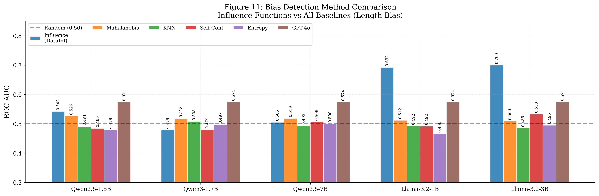

# Reproducibility & Extensions of *Understanding Impact of Human Feedback via Influence Functions*

Reproduction of Min et al. (ACL 2025) on **five reward models** (vs. the paper's one), plus all five proposal extensions. **Headline finding: architecture family — not parameter count — governs influence-function bias-detection AUC.** Llama-3.2-1B (AUC 0.692) cleanly beats Qwen2.5-7B (AUC 0.505) on length bias.

[**Full report (PDF)**](report/main.pdf) · [Original paper](paper.pdf) · [Project proposal](Reproducibility__Understanding_Impact_of_Human_Feedback_via_Influence_Functions.pdf)

---

## TL;DR results

| Model | Length AUC | Sycophancy AUC | Notes |
|---|---|---|---|
| Qwen2.5-1.5B | 0.5419 | 0.4982 | Near chance |
| Qwen3-1.7B   | 0.4791 | 0.5126 | Near chance |
| Qwen2.5-7B   | 0.5053 | 0.5054 | Near chance — **scale doesn't help** |
| **Llama-3.2-1B** | **0.6918** | **0.6185** | Clean signal at 1B |
| **Llama-3.2-3B** | **0.6996** | **0.5787** | Best overall |

The Qwen failure mode is a **gradient bottleneck**: linear probes on Qwen activations achieve AUC ≈ 0.7, but the LoRA gradients on preference loss lose the signal. The gap *widens* with scale.



---

## Repository layout

```
.
├── report/                      # LaTeX report + 16 figures
│   ├── main.tex                 # Overleaf-ready
│   ├── main.pdf                 # Compiled (10 pp)
│   └── figures/                 # fig1–fig15 PDFs
├── src/
│   ├── influence/               # DataInf + OPORP, gradient caching
│   ├── baselines/               # Mahalanobis, KNN, quality, GPT-4o
│   ├── reward_modeling/         # LoRA reward-model trainer (TRL)
│   ├── data/                    # length / sycophancy / BeaverTails prep
│   ├── labeling_strategy/       # HelpSteer2 SVM weight update
│   └── evaluation/              # AUC / AP / TNR@80 metrics
├── scripts/                     # one entry-point per experiment
├── configs/                     # reward-model YAMLs (5 models × 2 biases)
├── logs/figures/                # all generated figures (.pdf + .png)
└── README.md
```

Heavy artefacts (`dataset/`, trained adapters in `logs/<model>/`, gradient caches) are gitignored. JSON result files and figures are tracked.

---

## Reproducing the headline experiments

### 0. Setup

```bash
conda create -n if_rlhf python=3.11 -y && conda activate if_rlhf
pip install -r requirements.txt
export PYTORCH_CUDA_ALLOC_CONF=expandable_segments:True
```

GPU recommended: ≥16 GB for 1.5–3B (4-bit Qwen / bf16 Llama), ≥32 GB for Qwen2.5-7B.

### 1. Build the bias-injected datasets

```bash
bash scripts/run_data_prep.sh       # length + sycophancy from Anthropic-HH
python -m src.data.make_beavertails_dataset   # safety bias (extension E)
```

### 2. Train reward models (10 = 5 models × 2 biases)

```bash
bash scripts/run_baseline_models.sh
```

### 3. Cache gradients + compute influence

```bash
bash scripts/run_gradient_caching.sh
bash scripts/run_influence.sh
```

Saves to `logs/<model>_<bias>/influence_results.json`.

### 4. Run extensions

| Extension | Command | Output |
|---|---|---|
| A1 — non-LLM baselines | `python scripts/exp_baselines.py` | `logs/<m>_<b>/baseline_results.json` |
| A2 — GPT-4o baseline | `python scripts/exp_llm_baseline.py --bias length` | `logs/llm_baseline_length_shots2.json` |
| B1 — val-size ablation | `python scripts/exp_valsize_ablation.py` | `logs/valsize_ablation.json` |
| B2 — few-shot ablation | `python scripts/exp_llm_baseline.py --n_shots {0,1,2}` | `logs/llm_baseline_*_shots*.json` |
| C — top-k detection | `python scripts/exp_topk_detection.py` | `logs/topk_detection.json` |
| D — labeling strategy | `bash scripts/run_helpsteer_labeling.sh` | `logs/Qwen2.5-1.5B_helpsteer_bob1/labeling_strategy_results.json` |
| E — BeaverTails safety | `bash scripts/run_beavertails.sh` | `logs/Qwen2.5-1.5B_safety/influence_results.json` |

Requires `OPENAI_API_KEY` for A2 and B2.

### 5. Regenerate all figures

```bash
python scripts/generate_paper_figures.py
```

Produces `logs/figures/fig1.pdf`–`fig15.pdf`.

### 6. Build the report

```bash
cd report && pdflatex main.tex && pdflatex main.tex
```

---

## Key implementation notes

- **TRL column names.** TRL 1.1+ `RewardTrainer` expects `chosen_ids` / `rejected_ids`, not `input_ids_chosen`. HelpSteer2 and BeaverTails datasets have a TRL-renamed sibling (e.g. `dataset/beavertails_dataset_trl`).
- **Llama `pad_token_id`.** `eos_token_id` for Llama-3.2 is a list `[128001, 128008, 128009]`. Use `eos[0] if isinstance(eos, list) else eos`.
- **Mahalanobis singular covariance.** When `n_eval < feature_dim`, project to `min(n_eval-1, 512)` PCA components first.
- **DataInf vs TracIn.** DataInf (Kwon et al., 2024) gives a closed-form LoRA-friendly Hessian inverse; combined with OPORP random projection (Li, 2023), it is ~2.5× faster than TracIn for the same AUC.

---

## Hardware & cost

Total reproduction: ~53 GPU-hours on a single RTX 5080 (16 GB) + RTX 5090 (32 GB for Qwen2.5-7B) + ~$10 OpenAI API. Per-phase breakdown is in [report Appendix B](report/main.pdf).

---

## Citation of the original work

> Min, T., Lee, H., Kwon, Y., Lee, K. (2025). Understanding Impact of Human Feedback via Influence Functions. *ACL 2025*, pp. 27471–27500.

If this reproduction is useful to you, please also cite Min et al. and Kwon et al. (DataInf, ICLR 2024).

---

## Author

Henry Yuhang Wang · University of San Francisco · `henryyuhangwang@gmail.com`
